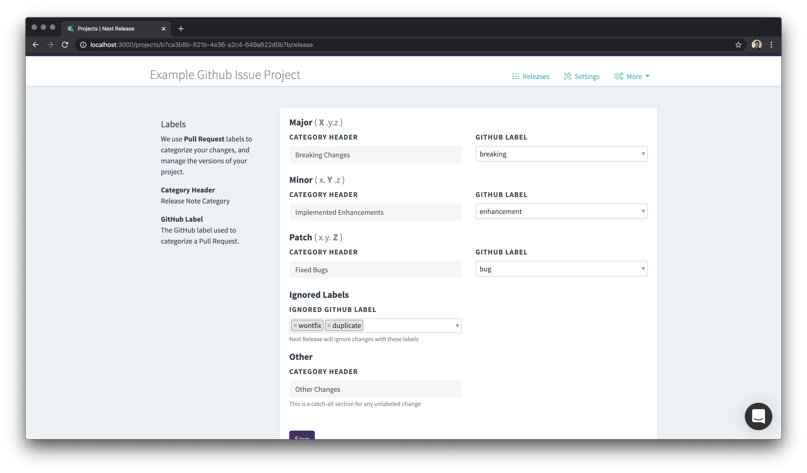

<iframe src="https://www.loom.com/embed/fb7997232c194f3fb82044fa835bf302" frameborder="0" webkitallowfullscreen mozallowfullscreen allowfullscreen style="position: absolute; top: 0; left: 0; width: 100%; height: 100%;"></iframe>

We've shipped some new features to help give you more flexibility and options when creating your release notes.

### Include Github Issues in Your Release Notes

Do you use a workflow that uses Github issues? Next Release now can add github issues to your release notes

If you want to stop including pull requests in your release notes entirely, you can now stop including those changes
in your release notes.

### Ignore Changes

Tools like Dependebot, Synk, or Renovate are great when you don't want to manage dependency upgrades by hand (especially when they are
critical security updates and you have a great test suite), but they really add a lot of churn.

Now you can automatically ignore all of these changes in your release notes by adding which labels you want to ignore
in your "Ignored Labels" in your label settings.

### Syncing Releases with Github

If you have a workflow you use to create your releases at Github or in your CI/CD process, Next Release will now
listen for the release creation events on Github and sync our release status with what happens in Github.

There are some additional configuration options you can toggle to manage if and how Next Release creates releases in Github:

-   Optionally add a configurable version tag to your repository
-   Publish an release in Github on the Releases page (Requires tag) [See our example repository](https://github.com/nextreleaseio/next-release/releases)
