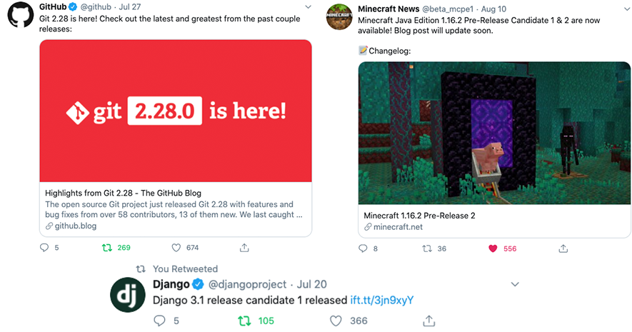

Using your changelog to updating your followers to product changes via twitter
helps to:

-   Increase engagement with new features
-   Alert users to bug fixes they’ve been waiting for
-   Drive up repeat usage of your application
-   Expand awareness of your product
-   Create a forum for customer feedback and support

These are a few of the reasons why open source communities, game developers,
and other leading technology companies tweet out notifications about their
latest product updates.

You can now start automatically tweeting your latest release notes
with our Release Note Twitter Integration by connecting your twitter
account and enabling tweets for the projects you would like tweets to
go out for:

<video style="width: 100%;" controls>
<source src="https://next-release-public-assets.s3.us-east-2.amazonaws.com/twitter_integration.mp4" type="video/mp4">
  <source src="https://next-release-public-assets.s3.us-east-2.amazonaws.com/twitter_integration.webm" type="video/webm">
  Your browser does not support the video tag.
</video>
