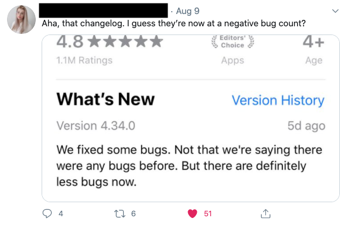
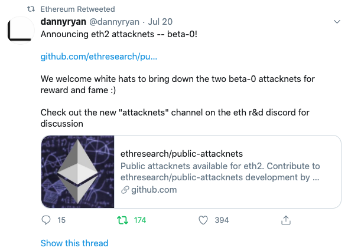
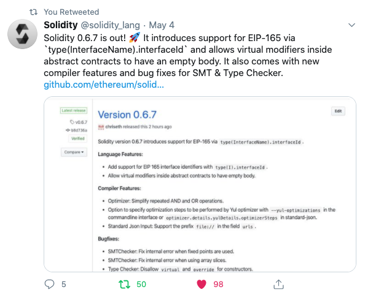
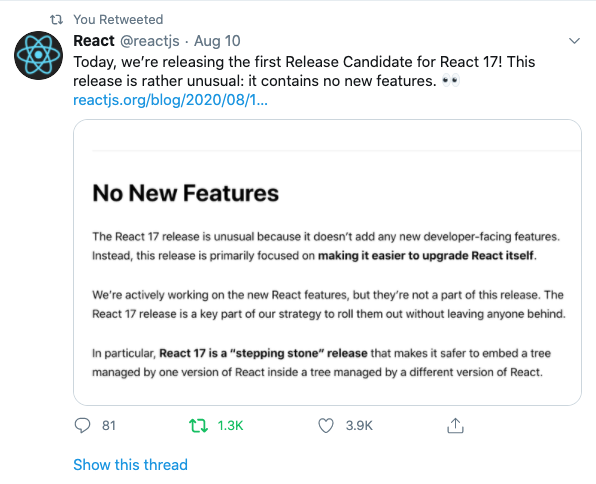
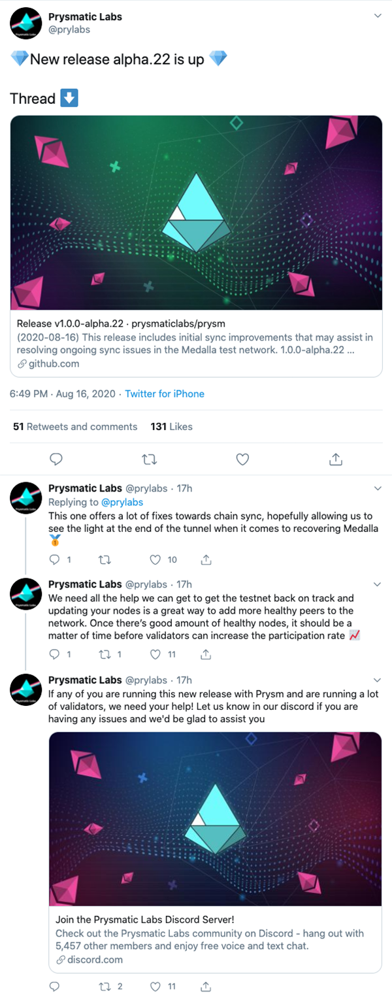
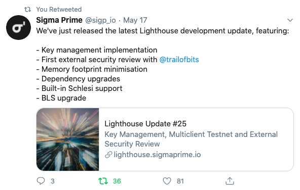

Twitter has become one of the leading platforms for teams to share
their release notes on. In the last 15 days, over 700 organizations posted more than
800 changelogs to the platform receiving over 9,700 likes and 15,500 retweets.
This is driven by the vibrant developer community
that lives on Twitter, as well as the format of tweets aligning well with
quick iterative updates on software solutions. These two aspects create a great forum
for gathering input from contributors and enabling supporters to share updates
with friends and colleagues.

## Community Engagement Platform

Leaders in developer operations such as GitHub and Heroku dedicate
entire Twitter accounts to managing their changelog notifications, helping
others stay up to date with what has been changed, fixed, and deleted from
their systems. These accounts give their teams feedback on what has been deployed,
enabling sentiment analysis of core features and identifying bugs that users find
and share.

### Rapid Feedback

Socializing changelogs on Twitter allows your community members to easily share your notes with others and
comment about them on their feeds. This enables team members to vocalize
their thoughts on recent releases and lets customers give you feedback quickly
to help your team make better decisions going forward.

This is why teams like Reactjs and Ethereum use Twitter to encourage
early adoption of alpha and beta releases so that more bugs and security
vulnerabilities can be found before production deployment; helping reduce
change failure rates, time to resolution, and cost to fix.

### Engagement, Collaboration, Support, and Sharing

Building a community around your product takes consistent connection
with your team, your customers, members who rely on your subject matter expertise, and your
partners. Release notes are an excellent touchpoint that provides a focal point to
collaborate with each of these stakeholders, and Twitter offers a hosted platform to
engage on. Using Twitter, you gain access to the existing developer communities
and can reduce the need for building and maintaining your own custom portal.

### Brand Building & Awareness

Like building a community, building your brand means staying consistent
when engaging with customers. Twitter lets you showcase your team’s brand
via small snippets of content around your releases and via transparent
responses to users who engage the release. Using your Twitter account to
engage with your community outside of release notes helps to garner additional
followers, which in turn increases the number of people who see your latest
releases, which drives further engagement & sharing, helping to facilitate broader
adoption and usage.

### Lead Generation

As you build your brand and reputation on Twitter, the platform becomes an organic
lead generation solution that targets individuals who can benefit from
your solution and puts your information in front of them. You can also
utilize your tweets and changelogs to prompt existing users and prospects
to check out updates you’ve made to your application. A great way to drive
people to your site is by only sharing snippets of what has been updated. By
providing a teaser and a link to the full release note or the actual area of
your software that you updated, you can move interested community members to a
more vibrant version of the release notes.

### Security Improvements

Security threats continue to grow. With [75% of vulnerabilities being
caused by indirect dependencies](https://www.zdnet.com/article/more-than-75-of-all-vulnerabilities-reside-in-indirect-dependencies/),
package managers must notify teams relying on their product about
security fixes as quickly and loudly as possible. By incorporating
Twitter into your community engagement ecosystem, you’re able to promptly
notify teams of security updates that your team has made and empower the
community to share them.

### Increase Feature Adoption

Release notes let customers and prospects know what new things your
team has added to your product. If your changelog isn’t shared with users,
they have to learn about changes by stumbling across them when using your
package or platform. Since your users are already on Twitter, it’s a great
way to get new enhancements in front of them so that they can try them out.

## Catalog of Changelog Examples

There are a multitude of ways to share your release notes on Twitter. Here
are a few of the concepts that we built our [automated release note tweet
generator](https://www.nextrelease.io/blog/tweet-your-changelog-on-twitter) off.

### Minimalist Release Tweets

Minimalist release notifications are most common for larger releases that
follow longer release cycles, such as those followed by major frameworks
like EmberJS & Django Web Framework.

### Hook Release Tweets

For medium to long release notes, another option is a hook release tweet.
This type of tweet provides a tease of what is included within the latest
release but directs followers to get out of Twitter and come to a team’s
product site to find out more.

### Context Thread Tweet

Some teams like to provide additional information around a release. Whether
it’s to provide context to the release or pre-emptively engage with your
community, this is the direction you’ll want to take.

### Full Changelog Tweet

For smaller, more iterative releases, some teams like to capture the entire
release note in their tweet so that their community can quickly identify if
there are changes that impact them and whether or not they need to take any
action. Taking this approach enables these users to do all of this from
Twitter without needing to load additional pages or leave the Twitter interface.

For more examples of release note tweets, checkout our
[Teams Tweeting Changelogs Twitter List](https://twitter.com/i/lists/1295828543885238274).
If your team posts your changelogs to Twitter and would like to be added to our list so
that we can showcase and retweet your notes then
[send us a message](https://www.nextrelease.io/contact) with your team's Twitter account.
