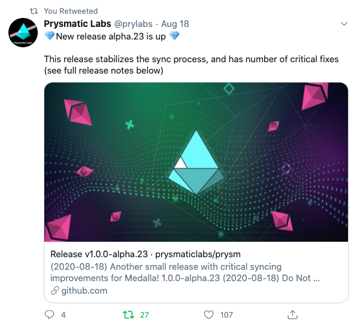
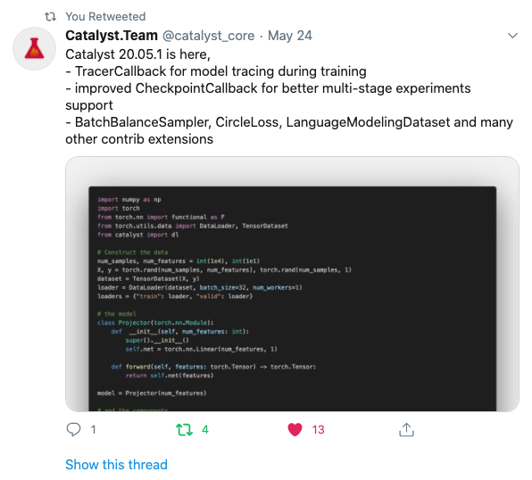

While developing our Twitter Release Note Integration, we reviewed hundreds of
changelog tweets and talked with multiple teams about why they publish notes to
twitter and how they structure them.

There are plenty of ways to share release notes on Twitter. The three most common
practices are full note, minimalist, and hook notifications. Full note tweets
include the complete details of the latest release notes. The minimalist method
announces that a release has occurred and provides followers with a link to its
changelog. Hook notifications provide some teaser information highlighting key
changes made in the release and aim to give followers just enough information to
be valuable to them while limiting exposure, encouraging them to engage with the
tweet, or clicking the link for additional information.

We've chosen to design our changelog posts to Twitter around these notification
methods to let teams use the notification method that aligns with their release
management process. For organizations that tend to have bigger releases with more
highlights than can fit into a single tweet, a minimalist notification enables a
team to notify their community that an update occurred and inform them of all the
changes via their hosted release notes.

For teams with smaller releases, a full or hook notification gives your community
a place to socialize about the release. Having your community socialize about the
release helps:

-   Gather immediate feedback from active users
-   Drive adoption of new features
-   Promote verification of bug fixes
-   Spread news of the release to other users and different communities
-   Increase the quality of traffic coming to your full changelog

Design Objectives
When designing what changelogs look like when published to Twitter, we have a
few core objectives. We wanted to:

-   Increase engagement with release notes (comments, likes, retweets, link clicks)
-   Effectively communicate changes with limited overhead to customers and their community
-   Accommodate long-running and rapid release cycles
-   Align with Twitter culture and styling

With all of our integrations, we work to deliver the right information, to the
right people, in the way they expect, based on their chosen medium of engagement.
Twitter has a strict culture centering around 280 characters and favors imagery and
visual stimulation supporting the characters displayed.

Since the average changelog is 270 characters, and some can be hundreds of pages long,
we developed a set of algorithms to condense the release note's content to about 250
characters. These algorithms give us enough space also to include a link to the full set
of notes, which takes up 23 characters.

For the extremely long changelogs, we found that it was easier for users to navigate to a
page containing the full set of release notes rather than summarizing them into 250
characters. This led to the minimalistic notification method.

These initial design iterations are just our first attempt at helping teams connect with
their community on twitter. We're continuing to iterate on the designs based on what's
working for our customers. If you have any thoughts or ideas for improvements, please
[let us know](https://www.nextrelease.io/contact) :)
