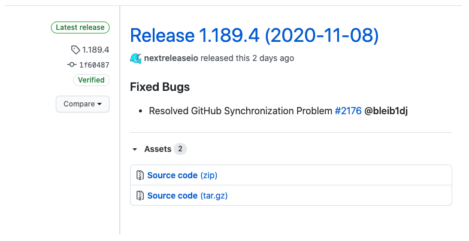

We’ve talked in the past about Calendar Versioning aka calver and how
many teams use it as the basis of their release versioning schema.
Today we’re adding the ability to extend your semantic version with an
ISO 8601 formatted date so that it appears like:

This makes it easy to see what day a version was deployed and determine which
version to rollback to in the case of an issue or outage.

To enable this feature go to your project settings and under the General
section and enable the “Add Date To Release Version” switch.

<video style="width: 100%;" controls>
<source src="https://next-release-public-assets.s3.us-east-2.amazonaws.com/enable_calver.mp4" type="video/mp4">
  <source src="https://next-release-public-assets.s3.us-east-2.amazonaws.com/enable_calver.webm" type="video/webm">
  Your browser does not support the video tag.
</video>
