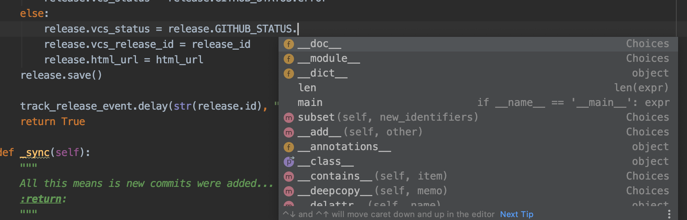
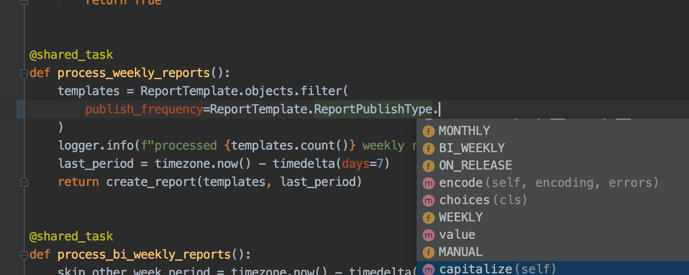

### Adding Autocomplete For Choice Fields Without Really Trying

The Next Release backend is written with Django Rest Framework, and since we started using
python 3.6, we've been gradually adding type annotations and dataclasses for some of our key data structures.

Enums are something I've wanted from the Django ecosystem: the added developer experience of autocomplete and ability
to change labels without changing the underlying data an important improvement.

For Django fields that include `Choices`, this is particularly evident. When you don't use a field or specific
choice often. It's a pain to look-up the model definition to see what all the choices are.

When using a field typed with the `Choices` class, when referencing the choices in your code, most editors (in my case PyCharm
professional), only give autocomplete suggestions to the `Choice` class itself:



Here's how we can switch our choice definitions to native `Enums`:

1. Import the base Enum class
2. Wrap it in your own custom class with a class method of `.choices()`
3. Extend that class when defining choice fields
4. Live life more enjoyably

Let's define the class

```python
from enum import Enum

class AbstractChoiceEnum(str, Enum):
  @classmethod
  def choices(cls):
      return [
          (member.value, name.capitalize())
          for name, member in cls.__members__.items()
      ]
```

The `.choices()` method iterates over all of the values of the enum and returns the familiar Choices `(value, label)` set of tuples.
Here's how you use it in practice:

```python

class UseBetterEnums(AbstractChoiceEnum):
  YES = 'yes'
  NO = 'no'
  UNSURE = 'unsure'


class MyModel:
  UseBetterEnums = UseBetterEnums  # I Like to include it on the model for easy reference
  use_enums = models.CharField(max_length=12, choices=UseBetterEnums.choices())

```

Now, when referencing your choice options, your editor can provide great suggestions like:

