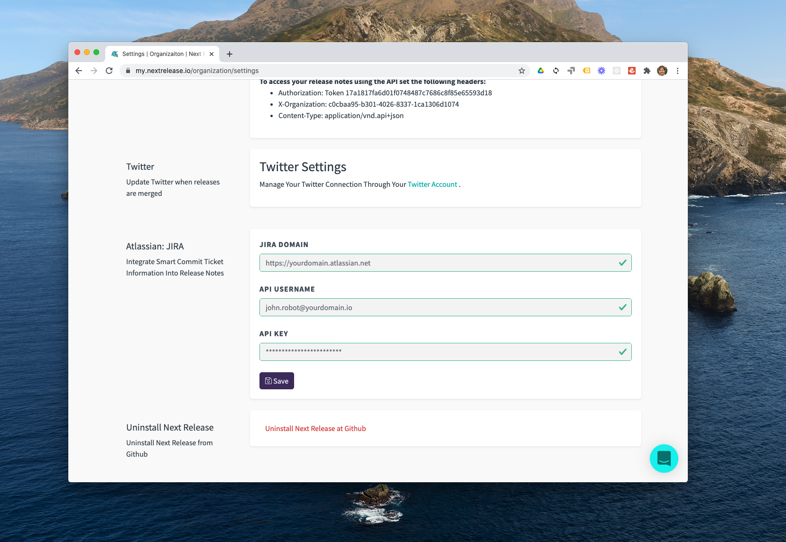
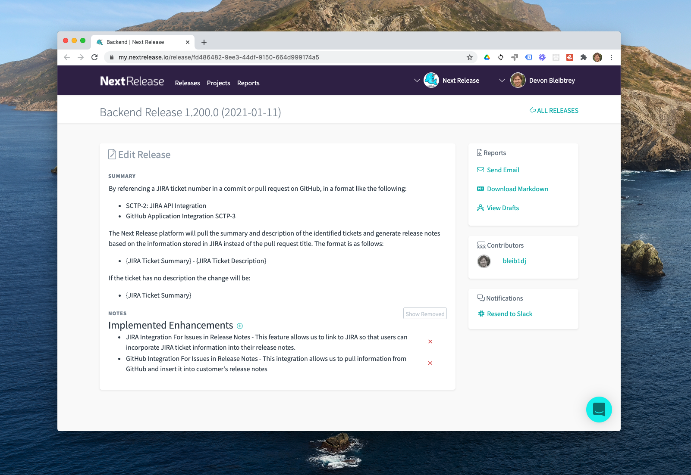

We're excited to announce that we're transitioning our JIRA integration
to open beta. Thanks to all the teams who participated in the alpha last
year and provided so much feedback!

You can start using this feature today by entering your JIRA instance
information into your
[organization’s settings](https://my.nextrelease.io/organization/settings).

Once you've enrolled, the Next Release platform will analyze all of your
team's commits and pull requests for references to JIRA tickets. If a
connection is found, the system will prioritize using the JIRA ticket's
summary and description to document the change in your release notes over
the pull request title that is normally used.

If multiple people reference the same ticket, the platform will ensure
that the information is only communicated once in your release notes. This
helps to alleviate noise that can be caused by highly focused pull requests
and commit messages that build on others to complete a feature or fix a bug.

## Notes on the JIRA Beta

-   The beta integration supports JIRA cloud instances
-   For server and data center JIRA deployments, please contact us about
    our enterprise integrations
-   If you use custom fields instead of the default summary and description
    fields in tickets, please contact us for custom configuration support
