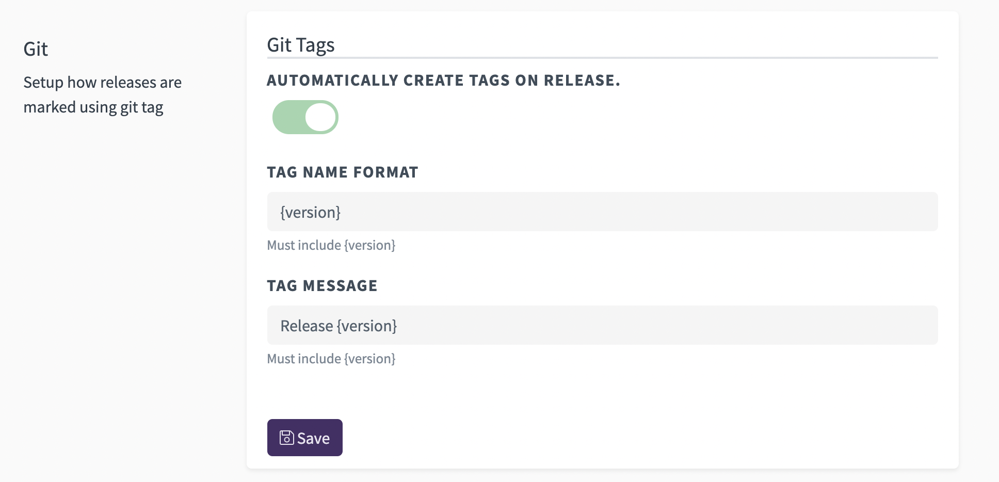

When creating a new release it's important to make
it easy for yourself and others to easily access the
specific commit that marks the release. That's why
git has a feature called [tagging](https://git-scm.com/book/en/v2/Git-Basics-Tagging)
that lets you do just that.

Regardless the hosting source code platform you use,
using git's tag feature lets you document which
commits are most critical. This makes it easy for anyone to
quickly jump between versions to inspect,
upgrade, or revert changes. The feature is integrated into
multiple services such as GitHub Releases where you can
tie a GitHub Release to the tag you created using git.

We've automated this process for you and by default will
tag every release you create. We use the version of the
release as the name of the tag, but you can easily
configure this to fit your style through your project
settings.

In your project settings you can modify both the name and message or
annotation used to document the tag. If you're using
GitHub this will also enable our automatic GitHub
Release feature which will utilize your configured
tags and release notes to socialize your release in
the GitHub activity stream.
