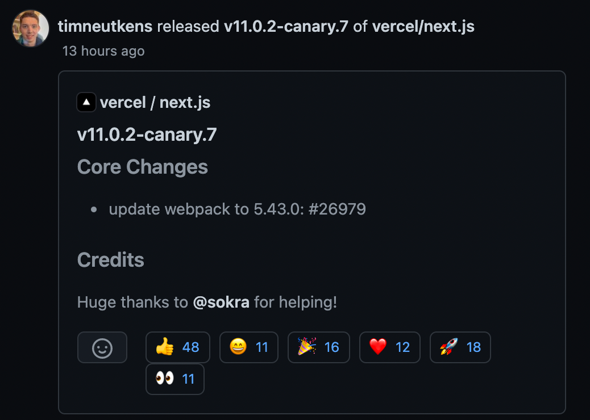
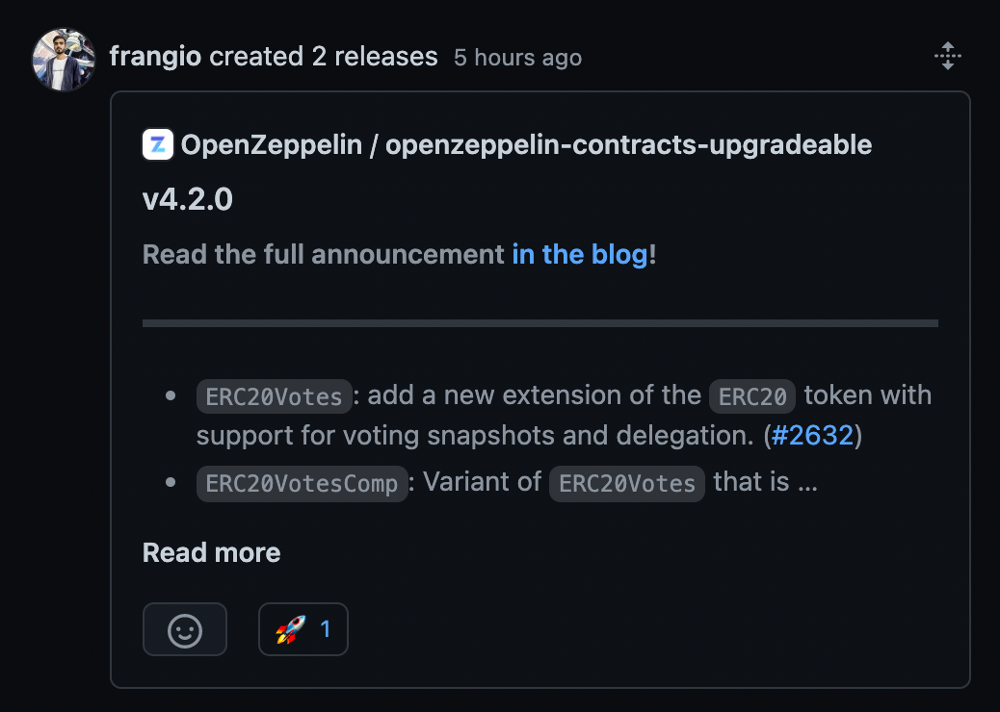
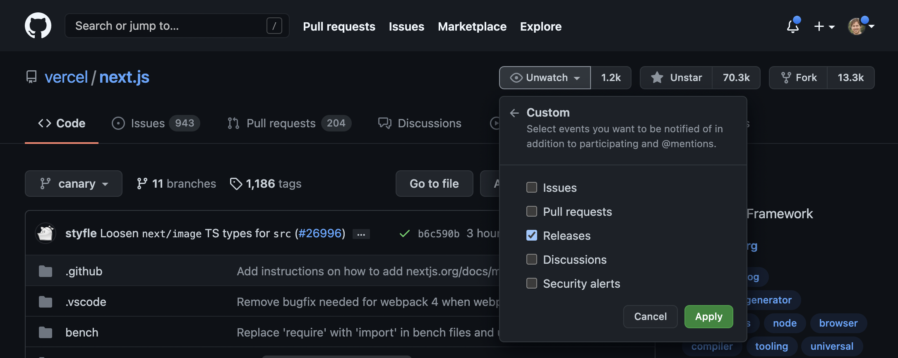
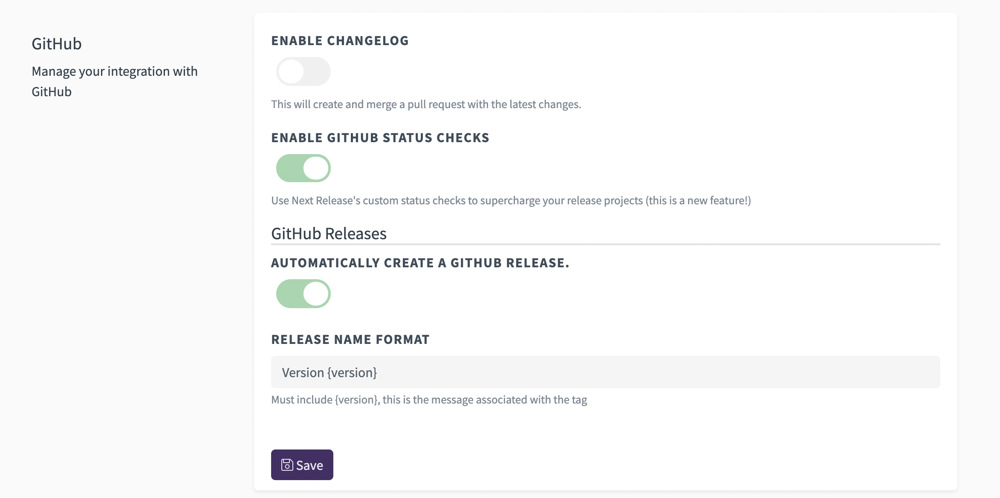

GitHub is the social network for developers.
From following repositories your team uses daily to
developers working on technology you're passionate about,
GitHub provides a place to engage on code.

The best way to drive engagement on your projects is to
post your Release Notes to GitHub on every release.

    

        
        <h4 class='text-center'><a class='text-sm' href='https://github.com/vercel/next.js/releases/tag/v11.0.2-canary.7'>Nextjs v11.0.2-canary.7 Release</a></h4>
        <h5 class='text-center'><a class='text-xs' href='https://github.com/timneutkens'>timneutkens</a></h5>
    

    

        
        <h4 class='text-center'><a class='text-sm' href='https://github.com/OpenZeppelin/openzeppelin-contracts-upgradeable/releases/tag/v4.2.0'>Openzeppelin Contracts Upgradeable 4.2.0 Release</a></h4>
        <h6 class='text-center'><a class='text-xs' href='https://github.com/frangio'>frangio</a></h6>
    

This keeps your community updated on recent developments and
lets them provide feedback on the changes. Releases are
so important that GitHub allows users to filter their notifications
to only alert them about new releases.

    
    <h4 class='text-center'><a href='https://github.com/vercel/next.js'>Nextjs Watch Releases</a></h4>

GitHub walks you through the manual steps on how to create a GitHub Release for your repository
in their [Administering A Repository Documentation](https://docs.github.com/en/github/administering-a-repository/releasing-projects-on-github/about-releases).
Instead of manually figuring out what version your next
release is, creating a git tag, compiling your release notes,
and inputting them into the GitHub Release form you can
configure your Next Release project to do it for you
automatically each time you cut a release.

Once you've linked your GitHub account with Next Release
we automatically enable GitHub Releases. We use
[git tag](/blog/mark-releases-with-git-tags)
to mark your release with the appropriate version,
take your automatically generated release notes, and
use both the create a GitHub Release that shows up
in everyone's GitHub activity stream that has permission
to view your repository.

If you'd like to tweak your
GitHub Release settings, navigate to your Next Release
project settings where you can enable / disable the feature
and configure the formatting for the title used
to create your GitHub Releases.

