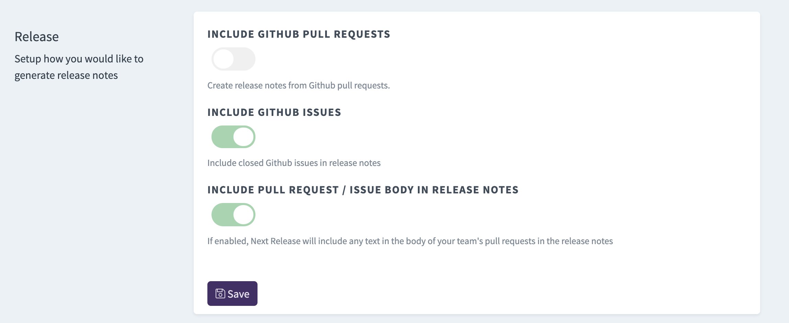

Do you organize your work in Github issues? Do those issues better reflect what work your team ships and want
to include in your release notes?

Now you can include all your closed Github issues into your release notes with Next Release.

To get started, view your project detail page, then click "settings." Click the toggle to "Include Github Issues."

(You can optionally disable including pull requests in your release notes if you want to ignore those.)

A few notes:

-   Issues will be added to your release notes as you close them, and will be removed if/when you reopen them.
-   We're a bit away from adding milestone support
-   If you toggle "include the issue body" toggle, the text from the issue description will be included in your release notes as well
-   [You can ignore issues with labels of your choosing](https://www.nextrelease.io/kb/ignoring-labels)
