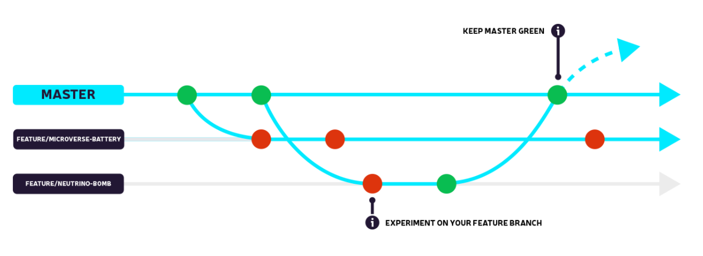
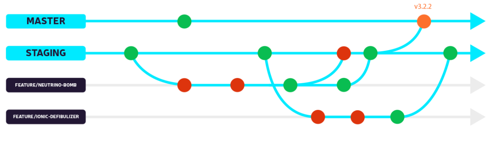

We help a lot of teams with their development pipelines and have seen everything from mailing
code updates around in emails to advanced gitflow strategies enabling automatic semantic versioning.
Wanted to share some of the most common deployments we see and link up to some more indepth documentation
for those of you that might need to optimize your flow for your current team. There are a few things to
recommend before diving into the strategies:

-   Use a version-control system (We recommend [git](https://git-scm.com/)), stop using email, it's 2020...
-   Build on the work of others, take a look at what some of the top platforms suggest on
    workflows (Suggest [GitHub](https://help.github.com/en/github/collaborating-with-issues-and-pull-requests/github-flow) & [Atlassian](https://www.atlassian.com/git/tutorials/comparing-workflows))
-   Take a look at [forking](https://www.atlassian.com/git/tutorials/comparing-workflows/forking-workflow) vs [branching](https://git-scm.com/book/en/v2/Git-Branching-Branching-Workflows) and how you can use them to suppliment eachother.

## Single Branch

<table>
<tr>
  <td>Common On</td>
  <td>Strengths</td>
  <td>Weaknesses</td>
</tr>
<tr>
  <td>
    <ul>
      <li>Open Source</li>
      <li>Muses</li>
      <li>Startups & Small Teams</li>
    </ul>
  </td>
  <td>
    <ul>
      <li>Lightweight and easy to deploy</li>
      <li>No complex workflows to learn or teach</li>
      <li>Quick to get up and running</li>
    </ul>
  </td>
  <td>
    <ul>
      <li>Limited Ability for Long-Lived Feature Development</li>
      <li>Limited Validation Capability</li>
    </ul>
  </td>
</tr>
</table>

### Overview

Making all pull requests against a single “master” branch is an excellent strategy to
quickly get up and running while reducing the cognitive overhead for developers and
managers. This ease of use makes a single branch release strategy popular among open
source developers and projects who have simple deployment needs.

This release strategy centers around a single master branch where all of the edits from
the contributors is staged. Forks, branches, and direct commits all funnel into this
primary branch and then the maintainers determine when to cut a new release and push
it out to their end-users.

## Staging & Deployment Branch Strategy

<table>
<tr>
  <td>Common On</td>
  <td>Strengths</td>
  <td>Weaknesses</td>
</tr>
<tr>
  <td>Small to Medium Teams</td>
  <td>
    <ul>
      <li>Lightweight</li>
      <li>Enables easy linkage of one branch to a staging environment and another to production</li>
      <li>Minimal validation capabilities</li>
    </ul>
  </td>
  <td>Limited Capability for Hotfixes</td>
</tr>
</table>

### Overview

This strategy requires a minimum of a staging branch and a production branch. The
staging branch acts as an area where all the upcoming changes in the next release
are aggregated. Often times the changes loaded into staging are validated and shipped
out to a production like environment where the team can manually test fixes and new
features prior to deploying them to production.

## Multi-Branch GitFlow Branch Strategy

<table>
<tr>
  <td>Common On</td>
  <td>Strengths</td>
  <td>Weaknesses</td>
</tr>
<tr>
  <td>Medium to Large Organizations</td>
  <td>
    <ul>
      <li>Maximum Validation Capabilities</li>
      <li>Support for numerous environments</li>
      <li>Support for Hotfixes</li>
    </ul>
  </td>
  <td>
    <ul>
      <li>Complex workflow requiring learning and teaching</li>
      <li>Increased overhead</li>
    </ul>
  </td>
</tr>
</table>

### Overview

There are multiple strategies that teams use when they move into multi-environment deployments.
The most common, standardized workflow is the [GitFlow Workflow](https://datasift.github.io/gitflow/IntroducingGitFlow.html),
which was first published by [Vincent Driessen at nvie](https://nvie.com/posts/a-successful-git-branching-model/).
This git workflow is designed to be a release
strategy and provides the most flexibility in validating updates that are meant for
production, while still enabling hotfixes to go directly out if there is a large enough issue.

The most common complaint we see with our customers is that GitFlow is too complex. As with any workflow,
there's always room for improvement. If the complexity of Gitflow is an issue for your team
I'd recommend checking out [Daniel Ivanov's article](https://www.toptal.com/gitflow/enhanced-git-flow-explained)
that outlines steps that can be taken to enhance it.

## Additional Information

If you're looking for more branching strategies or deeper dives on the above workflows check
these articles out:

-   [A successful Git branching model](https://nvie.com/posts/a-successful-git-branching-model/)
-   [GitHub Flow](http://scottchacon.com/2011/08/31/github-flow.html)
-   [GitLab Flow](https://docs.gitlab.com/ee/topics/gitlab_flow.html)
-   [GitFlow considered harmful](https://www.endoflineblog.com/gitflow-considered-harmful)
-   [OneFlow](https://www.endoflineblog.com/oneflow-a-git-branching-model-and-workflow)
