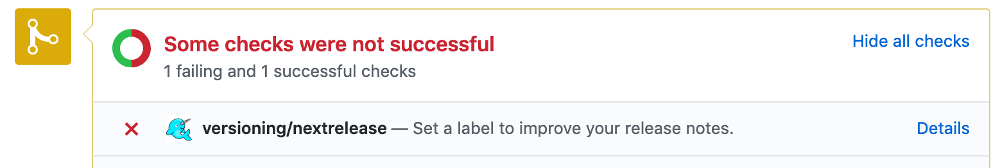
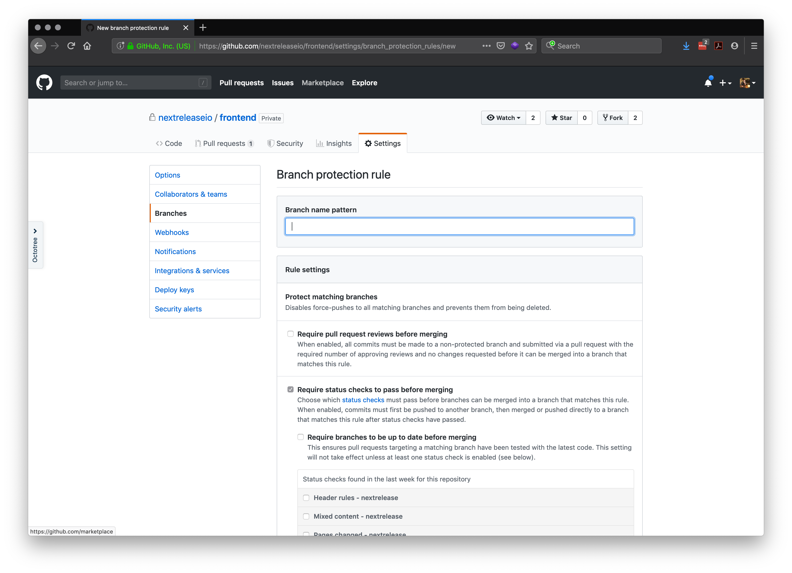

Next Release works best when you categorize your pull requests with labels. You can enforce status check to ensure each PR gets one.

To install a status check, configure your branch protection rules below to include the versioning/next-release
status check.

Now branches matching the pattern you've defined will fail status checks without an appropriate badge
(There are also tons of other helpful things you can do here like preventing WIP pull requests and more!)

