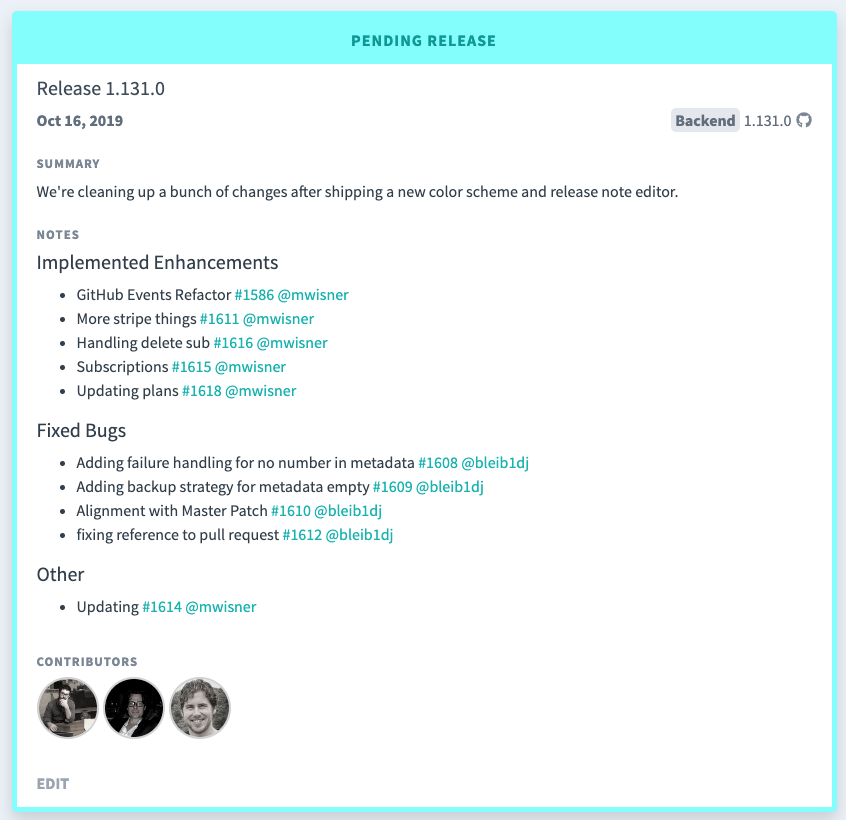
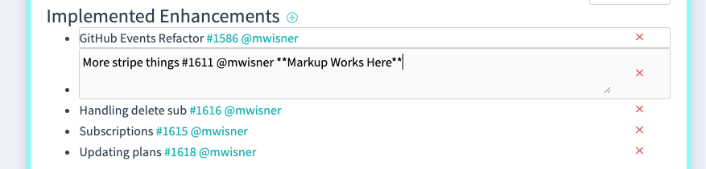
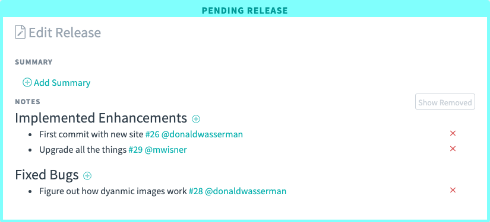

<iframe src="https://www.loom.com/embed/18a485817d7142f8b1cf1e911813a114" frameborder="0" webkitallowfullscreen mozallowfullscreen allowfullscreen style="position: absolute; top: 0; left: 0; width: 100%; height: 100%;"></iframe>

Next Release populates your release notes with every pull request your team has made.

But sometimes that's a little _too much_ information. Next Release lets you edit, add, and remove the entries on your
release notes, plus add custom summaries to add additional long-form text.

All of our release notes support full markdown, and you can include live GitHub references with `@username` or `#issue`.

Click “Edit” at the bottom of the release you want to edit.

To edit your release notes, double click on one of the releases you'd like to edit.

You can also add a free-form summary, by clicking add summary.

