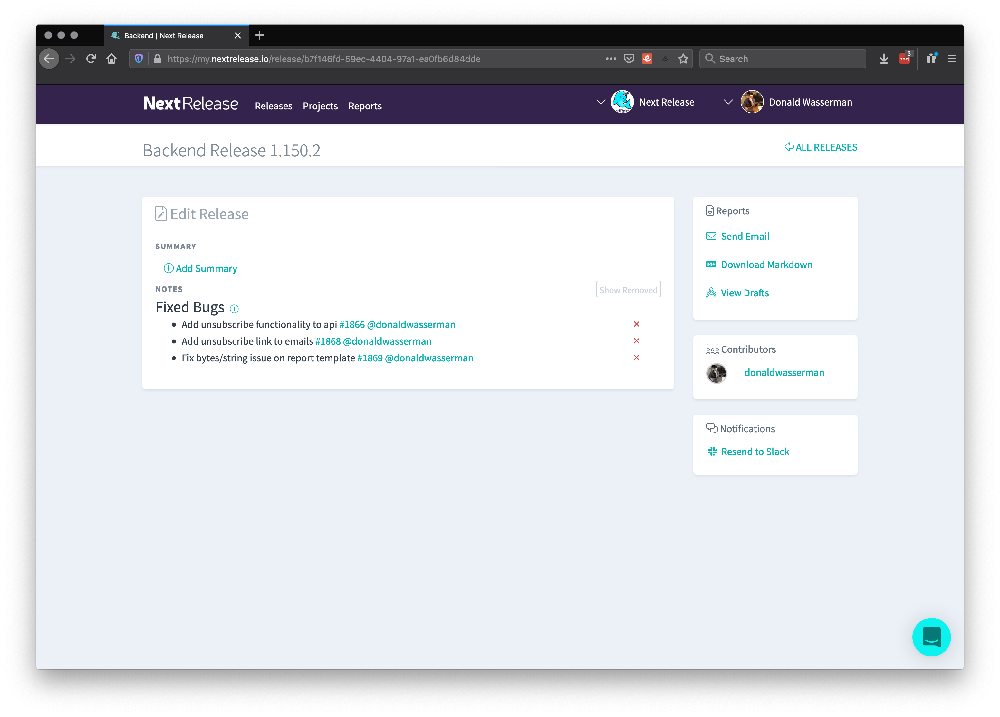
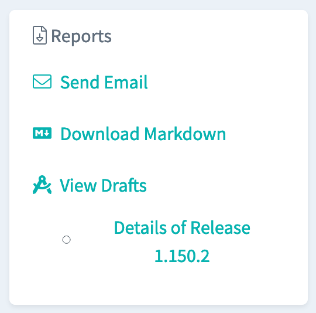

Did you know that you can send custom emails about your releases with almost
no effort?

From your release detail page, click "Send Email" on the right-hand navigation.

From there, you can create a subject line, add additional body copy to your email and select
the recipients for this report.

If you don't feel like sending it right now, select "Save as Draft," and come back to your work
at a later time.

These drafts are shared across your organization, so you can to invite others to collaborate and
this work isn't hidden in your inbox for the remainder of eternity.

If you need some more options download the release notes here, or manually send a slack
notification to the team you’ve configured.
