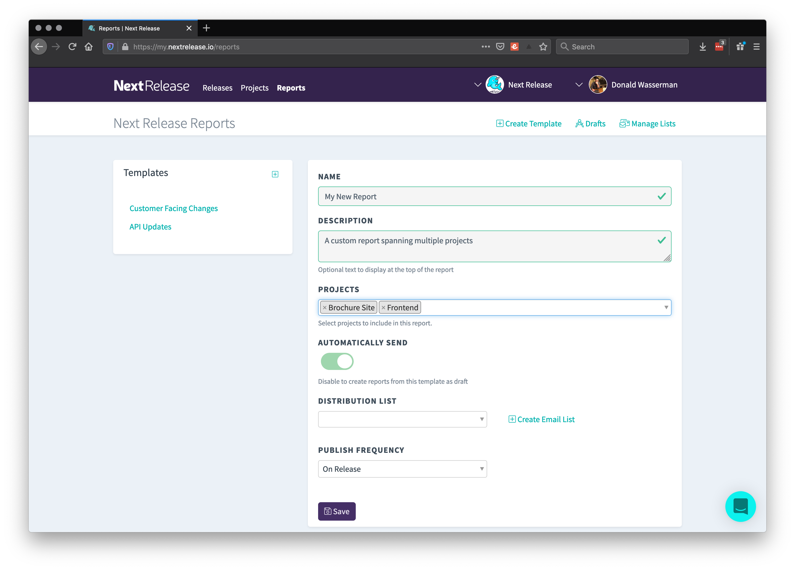
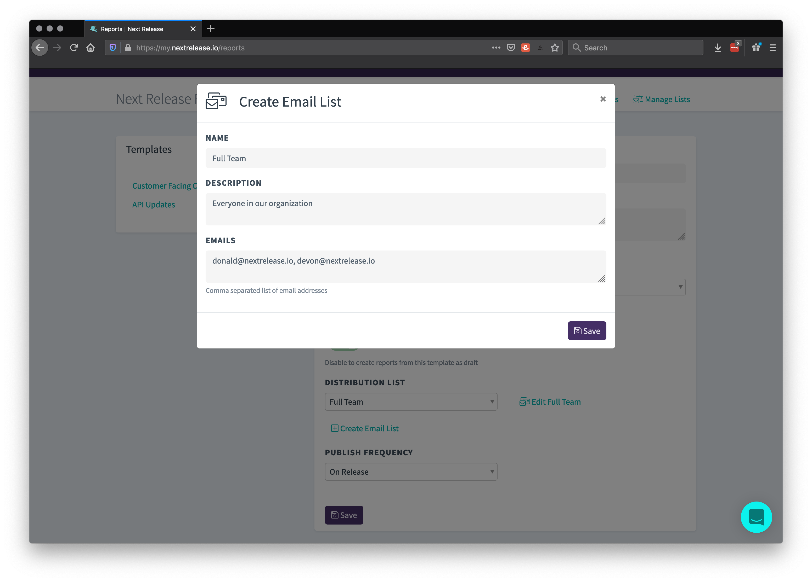

If you're tired of sending status updates and writing the same weekly, post-sprint or
monthly release emails by hand, Next Release Reports have what you need.

<iframe src="https://www.loom.com/embed/fb838822f53a4a20907073908fb819c1" frameborder="0" webkitallowfullscreen mozallowfullscreen allowfullscreen style="position: absolute; top: 0; left: 0; width: 100%; height: 100%;"></iframe>

From the `Reports` tab, you can create your first automated report. You have several
options of how to make our report templates fit your needs.

#### Name and Description

The name and description get translated to the subject line and an introductory section of the email
to give your readers more context about why they are getting this email.

#### Select Multiple Projects

This Report Template can include multiple projects you want. For example, you may want to
create one report for your engineering team that includes changes to the frontend and API,
but another one for the marketing team that includes changes to the Brochure Site and frontend apps.

#### Automatic Sending

You can configure your reports to automatically send when they get created (either on release or via a
fixed time period) or they can send as draft for your review before sending.

#### Create Custom Lists

You can create and manage custom email lists with Next Release to help you organize and manage
how you share reports across your team or external stakeholders. You can create and edit your
lists here on your report detail page or on the dedicated email page.

#### Publish Frequency

Here you can determine how often and when to publish your reports:

-   **On Release** Publishes every time you publish a release on any of your tracked projects
-   **Weekly** Sends the report with the weekly changes for every project on Sunday evening
-   **Bi-Weekly** Same as weekly, just every other week
-   **Monthly** Same as the others, just monthly
