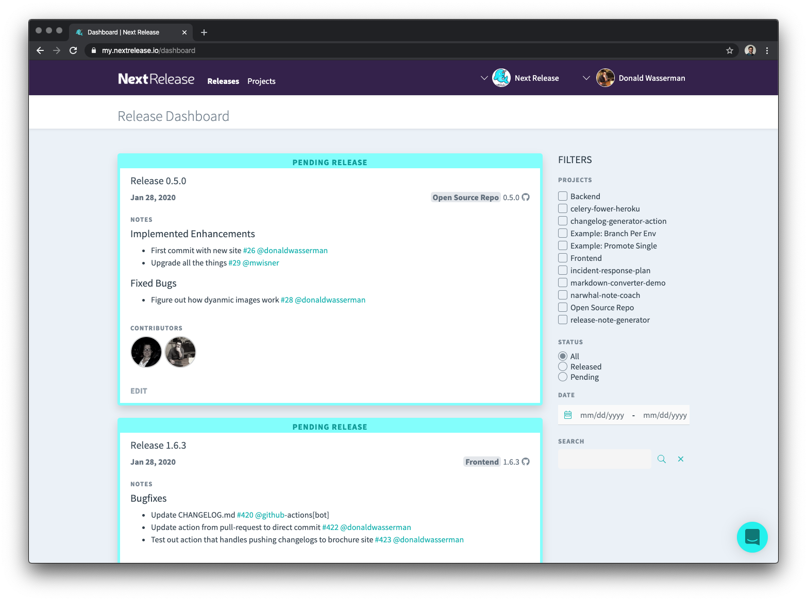

Looking for specific release notes? You can search and filter the entire collection of your organization's release notes
across every project.

###Filter Options
The release dashboard has the entire collection of your release notes. On right hand column, is the set of filters. Next
Release currently supports searching by:
- Project
- Release Status
- Release Date
- Searching by keyword

Searching will search the title,release notes and contributor's GitHub handles.

