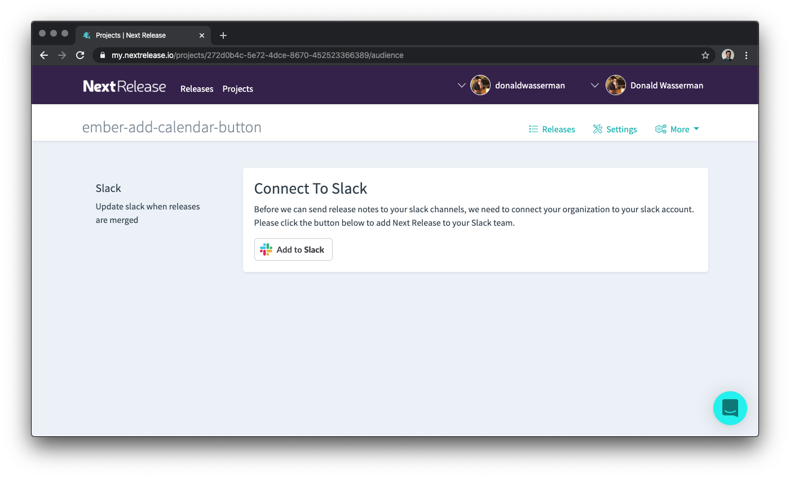

What's the point of having great release notes if you can't share them with your colleagues?

To add slack notifications to your projects, view the notifications section of your project.

See the whole process here!

<iframe src="https://www.loom.com/embed/1b75ba0764154161a8415b7170cf85d7" frameborder="0" webkitallowfullscreen mozallowfullscreen allowfullscreen style="position: absolute; top: 0; left: 0; width: 100%; height: 100%;"></iframe>
