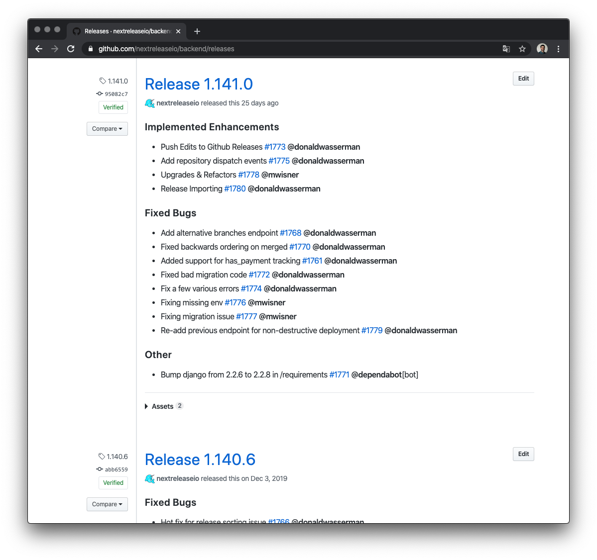

## Amazing Results, Zero Effort

Next Release works with your existing GitHub workflows: Write code, make a pull request, run checks, then merge.
There's no additional developer effort beyond using your existing labels!

Don't waste your time hand-crafting bespoke release notes by searching through Jira, Slack, and Slack. Next Release will
automatically add your release notes directly to GitHub. You can easily export them to markdown, slack, or even word documents.

Every pull request is recorded and automatically added to your release notes. With just a few configuration options you
can change which labels we use and how your release notes are organized. Next Release will also version, tag, and create
a release for you in your repository and GitHub.

