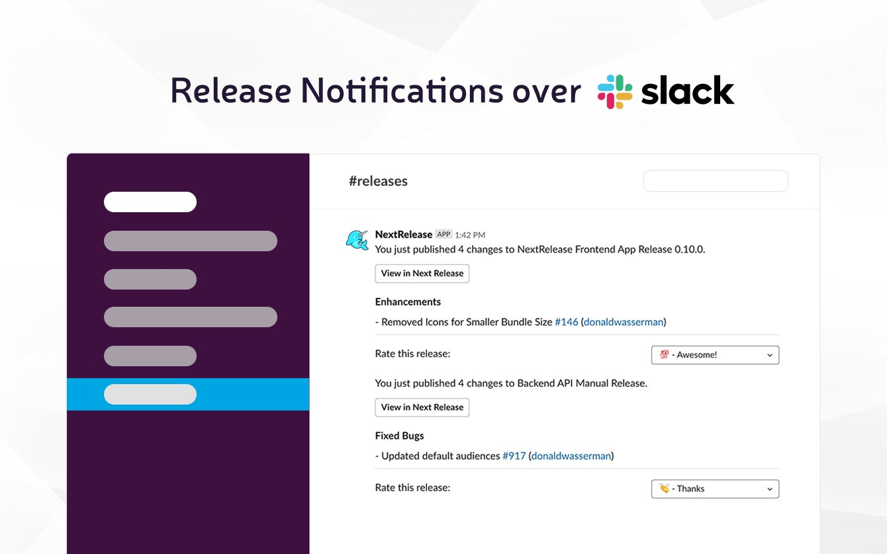

## Share Changes, Keep Moving Forward

Stop sending the same emails after ever release, sprint, or month. Let Next Release handle the repetitive work of
keeping your team informed with custom report templates.

Applications are growing more complex than ever before. Dependency management, deploying multiple services, and coordinating
efforts of engineering, product, marketing and sales, make it critical to have real-time updates of what releases are
shipping to production.

Next Release automatically ships your release notes when you ship code. You can use our built-in Slack integration or
custom report templates to share releases across teams and projects.

### Custom Reports

<iframe src="https://www.loom.com/embed/14b4a452474c4243b8a98ab5e31a550c" frameborder="0" webkitallowfullscreen mozallowfullscreen allowfullscreen style="position: absolute; top: 0; left: 0; width: 100%; height: 100%;"></iframe>

Next Release automates your ability to share your application's changes with your team. Setup recurring weekly,
biweekly, or monthly reports send your totally customized release notes to your key stakeholders.

With Next Release, it takes less than five minutes to go from 0 to automatically publishing your release notes with
categorized, effortless, and consistently organized release notes for every release, for every pull request.

### Slack Notifications

Our Slack integration will automatically inform your team when a release gets published: in real time and with fully
organized release notes! Now everyone on your team can see who shipped which features, bug fixes, or who is taking time
to pay down the technical debt that moves your product forward.

